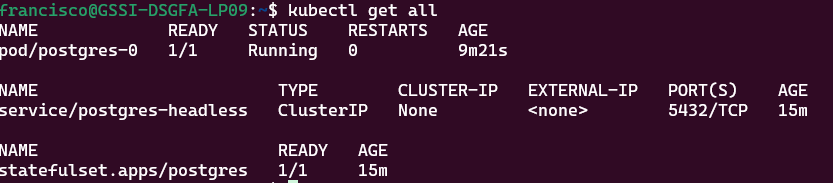
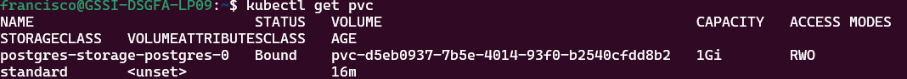
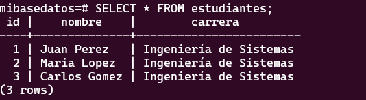
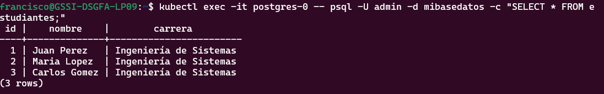

**a) Descripción:**
- Aplicar los conceptos de la clase 6 y 7
- Conceptos aplicados: Namespaces, ConfigMaps, Secrets y StatefulSets 

**b) Instrucciones paso a paso:**

1. Crear namespace

kubectl create namespace tarea-clase7

Result: namespace/tarea-clase7 created

2. Aplicar ConfigMap

kubectl config view --minify | grep namespace:

Result:  namespace: tarea-clase7

3. Aplicar Secret

kubectl get secret postgres-secret

Result: 

NAME              TYPE     DATA   AGE
postgres-secret   Opaque   2      11s

4. Aplicar Headless Service

kubectl apply -f postgres-headless.yaml

Result: service/postgres-headless created

5. Aplicar StatefulSet

 kubectl get statefulset postgres

 Result: 

NAME       READY   AGE
postgres   0/1     6s

6. Verificar que todo está corriendo
 kubectl get all

 Result:

| NAME | Baseline | STATUS | RESTARTS |AGE|
|---------|----------|------------|--------|
| pod/postgres-0  | 1/1 | Running | 0 |3m55s|

| NAME | TYPE | CLUSTER-IP  | EXTERNAL-IP |PORT(S)|
|---------|----------|------------|--------|--------|
| service/postgres-headless  | ClusterIP | None | <none>  |5432/TCP|
                        

| NAME | READY | AGE  |
|---------|----------|------------|--------|
| statefulset.apps/postgres  |  1/1 | None | 3m55s  |

7. Probar PostgreSQL

kubectl exec -it postgres-0 -- psql -U admin -d mibasedatos

Result:

mibasedatos=# SELECT * FROM estudiantes;
 id |    nombre    |        carrera
----+--------------+------------------------
  1 | Juan Perez   | Ingeniería de Sistemas
  2 | Maria Lopez  | Ingeniería de Sistemas
  3 | Carlos Gomez | Ingeniería de Sistemas

8. Demostrar persistencia

kubectl delete pod postgres-0

kubectl get pods -w

NAME         READY   STATUS    RESTARTS   AGE
postgres-0   1/1     Running   0          18s

kubectl exec -it postgres-0 -- psql -U admin -d mibasedatos -c "SELECT * FROM estudiantes;"

  id |    nombre    |        carrera
----+--------------+------------------------
  1 | Juan Perez   | Ingeniería de Sistemas
  2 | Maria Lopez  | Ingeniería de Sistemas
  3 | Carlos Gomez | Ingeniería de Sistemas

**c) Comandos de verificación:**

kubectl get all -n tarea-clase7

NAME             READY   STATUS    RESTARTS   AGE
pod/postgres-0   1/1     Running   0          8m7s

NAME                        TYPE        CLUSTER-IP   EXTERNAL-IP   PORT(S)    AGE
service/postgres-headless   ClusterIP   None         <none>        5432/TCP   14m

NAME                        READY   AGE
statefulset.apps/postgres   1/1     13m

kubectl get pvc -n tarea-clase7

NAME                          STATUS   VOLUME                                     CAPACITY   ACCESS MODES   STORAGECLASS   VOLUMEATTRIBUTESCLASS   AGE
postgres-storage-postgres-0   Bound    pvc-d5eb0937-7b5e-4014-93f0-b2540cfdd8b2   1Gi        RWO            standard       <unset>                 14m

kubectl get configmap,secret -n tarea-clase7

NAME                         DATA   AGE
configmap/kube-root-ca.crt   1      15m
configmap/postgres-config    2      15m

NAME                     TYPE     DATA   AGE
secret/postgres-secret   Opaque   2      15m

**d) Capturas de pantalla:**
1. 
2. 
3. 
4. 

## Parte 8: Limpieza 

### 8.1 Eliminar todos los recursos

kubectl delete namespace tarea-clase7

Result: namespace "tarea-clase7" deleted

### 8.2 Verificar

kubectl get namespaces | grep tarea-clase7

kubectl get pvc --all-namespaces | grep tarea-clase7

Result:No resources found
